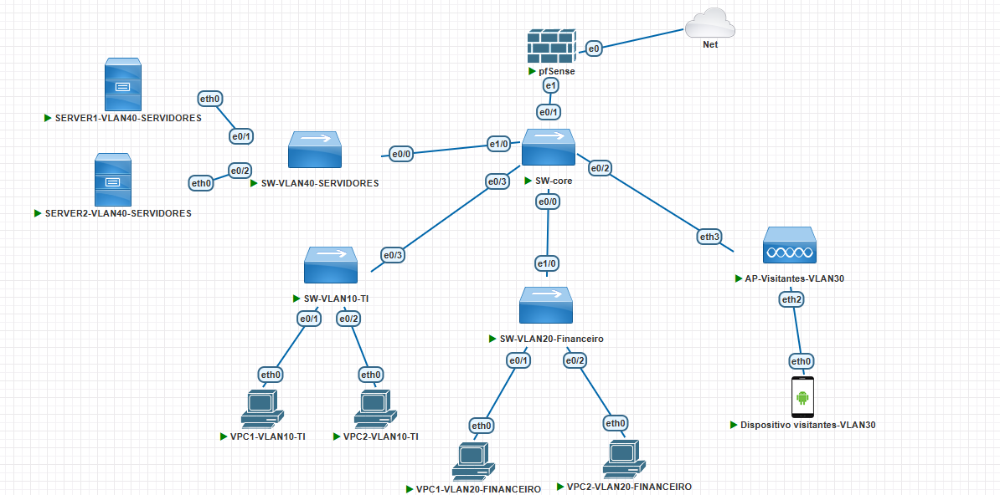
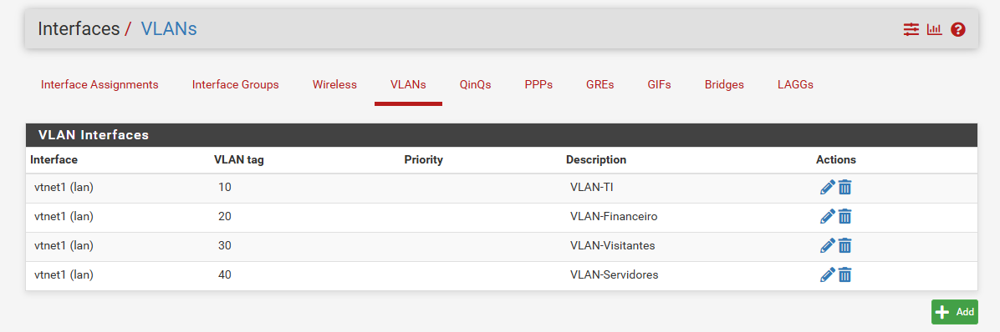
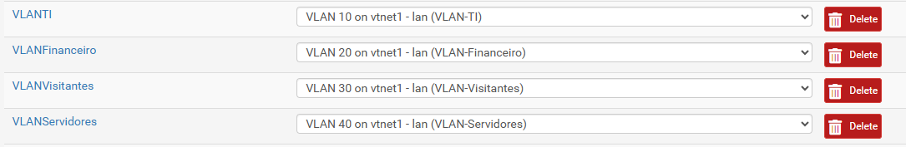
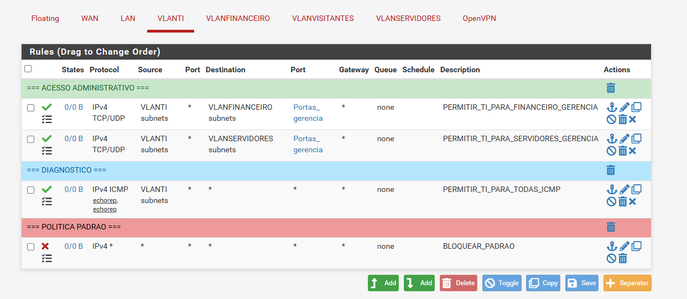
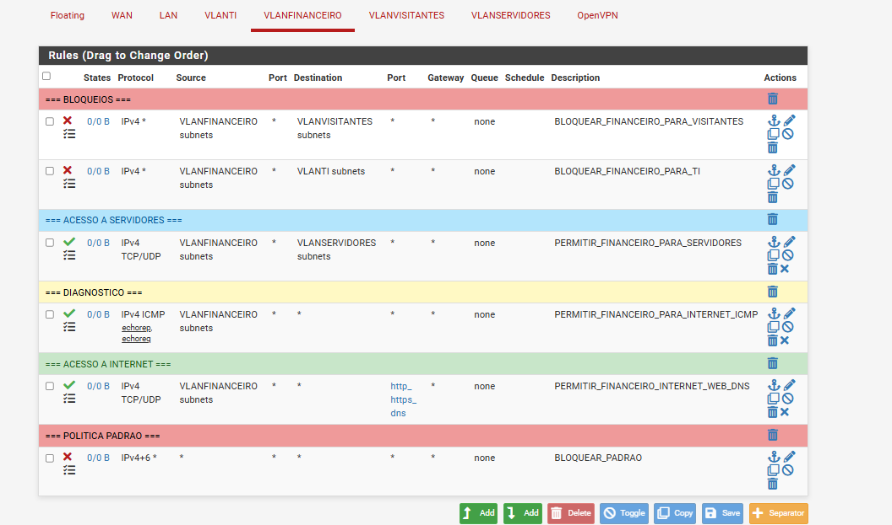
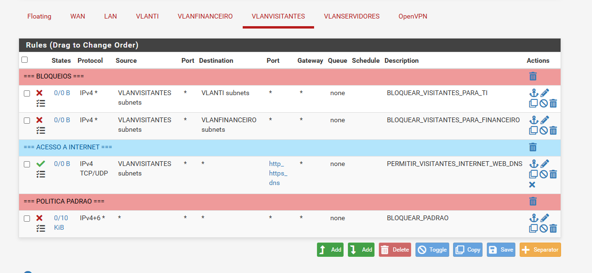
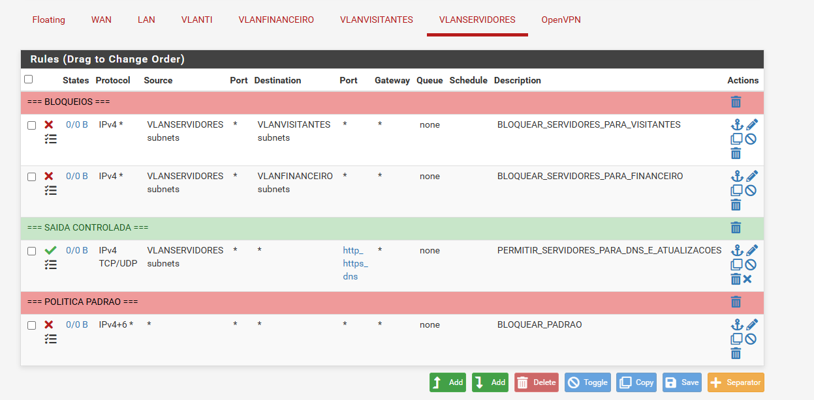

# Projeto de Redes com pfSense

Este projeto tem como objetivo a prática e o aprimoramento de conhecimentos em redes de computadores utilizando o **pfSense**. O foco principal é a implementação de **VLANs** e a criação de **regras básicas de firewall**, permitindo a segmentação da rede e o controle de tráfego entre diferentes setores.

---

## Topologia

  

**Figura 1:** Topologia da rede implementada no PNETLab com pfSense, switches e MikroTik.

A rede foi estruturada com um **switch core** como elemento central, responsável por interligar:

- 3 switches de acesso  
- 1 dispositivo MikroTik (simulando uma rede sem fio)

O switch core concentra e gerencia as seguintes VLANs:

- **VLAN TI**
- **VLAN Financeiro**
- **VLAN Servidores**
- **VLAN Visitantes**

Cada switch de acesso atende a uma VLAN específica (TI, Financeiro e Servidores). A **VLAN de Visitantes** está conectada ao **MikroTik (AP)**, sendo utilizada para a rede sem fio e garantindo o isolamento de dispositivos externos em relação à rede interna.

---

## Tecnologias utilizadas

- pfSense  
- VLANs (802.1Q)  
- MikroTik (simulação de rede wireless)  
- PNETLab  
- Switches gerenciáveis  

---

## Endereços IP

| Interface            | Rede / IP           | Descrição                    |
|----------------------|---------------------|------------------------------|
| WAN                  | 192.168.112.134/24  | Conectado via NAT no PNETLab |
| LAN                  | 192.168.1.1/24      | Interface interna do pfSense |
| VLAN 10 (TI)         | 192.168.10.0/24     | Setor TI                    |
| VLAN 20 (Financeiro) | 192.168.20.0/24     | Setor Financeiro            |
| VLAN 30 (Visitantes) | 192.168.30.0/24     | Rede de visitantes          |
| VLAN 40 (Servidores) | 192.168.40.0/24     | Servidores                  |

> Cada VLAN está associada a uma interface virtual no pfSense. O tráfego das VLANs é controlado por regras de firewall.

---

## Configuração do Switch Core

No switch core foram criadas 4 VLANs com os seguintes IDs:

- VLAN 10 – TI  
- VLAN 20 – Financeiro  
- VLAN 30 – Visitantes  
- VLAN 40 – Servidores  

A interface que conecta o switch core ao **pfSense** foi configurada em modo **trunk**, permitindo o tráfego de múltiplas VLANs através de uma única porta (802.1Q).

---

## Configuração dos Switches de Acesso

Nos switches de acesso foi criada apenas a VLAN correspondente a cada setor:

- Switch de TI → VLAN 10  
- Switch de Financeiro → VLAN 20  
- Switch de Servidores → VLAN 40  

As portas foram configuradas em modo **access**, garantindo isolamento por VLAN.

---

## Configuração do MikroTik

O MikroTik foi utilizado para simular uma rede sem fio no ambiente, devido à limitação do PNETLab, que não possui suporte nativo a wireless.

A VLAN de visitantes (VLAN 30) é entregue diretamente pelo switch core ao MikroTik.

O MikroTik está conectado em uma porta **access**, com IP fixo local para gerenciamento.

Internamente, foi utilizada uma bridge para interligar interfaces físicas, operando em camada 2.

Os dispositivos conectados recebem IP via DHCP do pfSense.

O MikroTik atua apenas como equipamento de camada 2, sem roteamento ou filtragem.

---

## Integração com o Switch Core

- TI → VLAN 10  
- Financeiro → VLAN 20  
- Servidores → VLAN 40  

A VLAN de Visitantes (VLAN 30) está conectada ao MikroTik.

---

## Configuração do pfSense

No pfSense foram criadas as VLANs na interface trunk do switch core.

Cada VLAN possui:

- Interface lógica própria  
- Servidor DHCP dedicado  

- VLAN 10 – TI  
- VLAN 20 – Financeiro  
- VLAN 30 – Visitantes  
- VLAN 40 – Servidores  

  

**Figura 2:** VLANs configuradas no pfSense

  

**Figura 3:** Interfaces lógicas para criadas para as VLANs no pfSense

O pfSense realiza:

- Roteamento entre VLANs  
- Distribuição de IP (DHCP)  
- Controle de firewall  

---

## Políticas de Firewall

As regras seguem:

- **negação por padrão (default deny)**  
- **menor privilégio**

### VLAN 10 – TI
- Acesso administrativo às VLANs de Financeiro e Servidores  
- ICMP liberado para diagnóstico  
- Demais acessos bloqueados  

  

**Figura 4:** Regras configuradas no pfSense para a VLAN TI

---

### VLAN 20 – Financeiro
- Acesso à VLAN de Servidores  
- Internet via HTTP/HTTPS e DNS  
- Bloqueio das demais VLANs  
- ICMP permitido  

  

**Figura 5:** Regras configuradas no pfSense para a VLAN Financeiro

---

### VLAN 30 – Visitantes
- Apenas acesso à internet (HTTP/HTTPS e DNS)  
- Bloqueio total das VLANs internas  

  

**Figura 6:** Regras configuradas no pfSense para a VLAN Visitantes

---

### VLAN 40 – Servidores
- Bloqueio de acesso a Visitantes e Financeiro  
- Saída controlada para internet  
- Acesso permitido conforme regras específicas  

  

**Figura 7:** Regras configuradas no pfSense para a VLAN Servidores

---

## Conclusão

Este projeto foi desenvolvido para prática e consolidação de conhecimentos em redes, com foco em VLANs, segmentação e firewall no pfSense.

Mesmo sendo um ambiente simples, ele simula cenários reais de redes corporativas, como separação de setores, controle de acesso e isolamento de tráfego.

A proposta principal foi aplicar na prática os conceitos estudados e entender como os componentes de rede trabalham juntos em um ambiente estruturado.

---

## Autor

**Leandro Lima** – Estudante de Redes